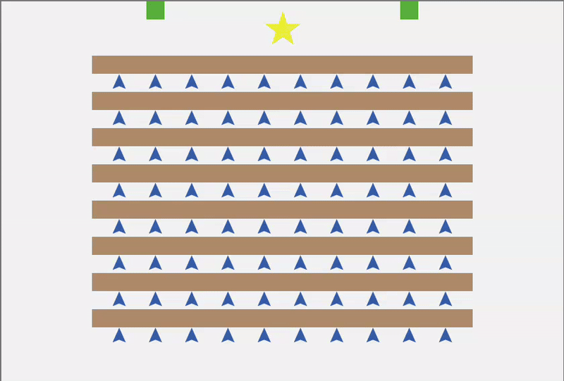
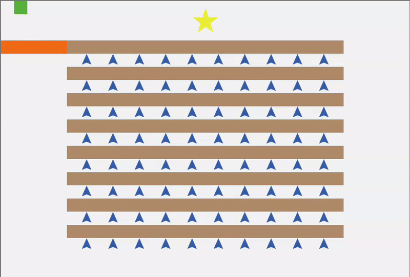
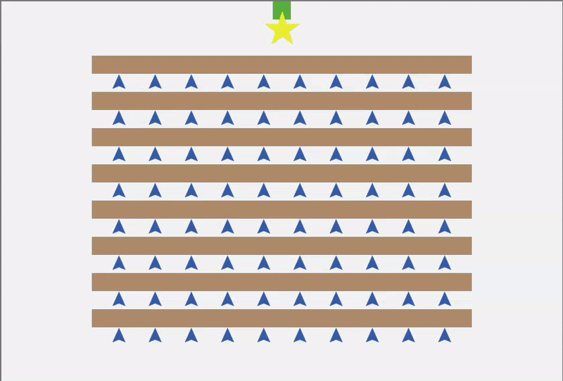
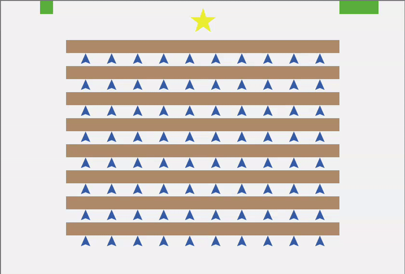
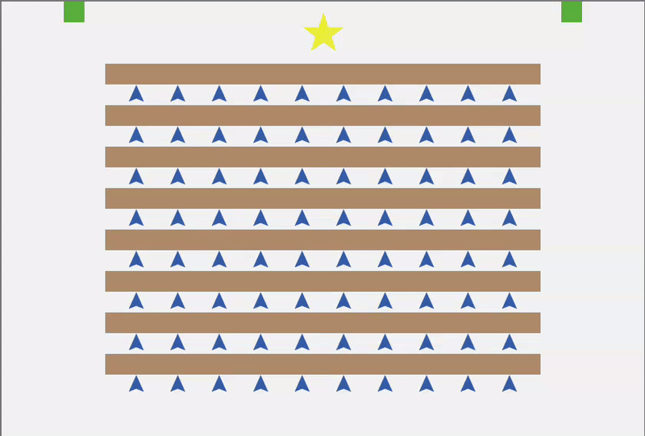

# Distributed AI: Multi-Agent Crowd Evacuation Dynamics

An advanced Agent-Based Model (ABM) developed to simulate high-density pedestrian flow using **Distributed Artificial Intelligence (DAI)** principles. This project moves away from simple reactive steering, implementing a sophisticated **Iterative Negotiation & Reservation Protocol** for spatial conflict resolution.

## 🔬 Core Engineering & Implementation

The system architecture is based on three pillars of distributed intelligence:

* **Iterative Reservation Protocol:** A decentralized coordination mechanism using asynchronous "patch-locking" (`reserved-by`) to ensure fluid, collision-free movement.
* **Game Theoretic Conflict Resolution:** Hierarchical priority (e.g., instructors vs. students) combined with greedy distance-based tie-breaking to optimize queue throughput.
* **Predictive Flow & Anti-Deadlock:** Implements **Short-term Intent Analysis** to allow movement into patches being vacated in the current tick, paired with a **Reservation Blacklist** to prevent local oscillations and gridlocks.
* **Dynamic Pathfinding:** Topological cost mapping via **Dijkstra/Flood Fill** algorithm, ensuring 100% reliability in non-Euclidean environments with complex barriers.

---

## 🚀 Experimental Scenarios & Benchmarking

The model's coordination resilience was evaluated across 5 distinct environments. 

### 🏆 Featured: Main System Demonstration
The **Main Demo** showcases the baseline performance of the Iterative Reservation Protocol under balanced, symmetric exit conditions.

  

---

### 📂 Stress Test Gallery
Below is a comparative breakdown of the specific coordination challenges addressed in each specialized environment:

| **Blocking Wall (Pathfinding)** | **Single Bottleneck (Queuing)** |
| :---: | :---: |
|  |  |
| **Complex Navigation:** Dijkstra accuracy through barriers. | **Crowd Pressure:** Emergent single-file formation. |

| **Asymmetric Capacity** | **External Symmetric** |
| :---: | :---: |
|  |  |
| **Resource Disparity:** 1-vs-3 exit friction study. | **Flow Distribution:** Cost-map consistency. |

> [!TIP]
> Each GIF demonstrates a different edge case of the **Iterative Negotiation Protocol**. For a deeper dive into the metrics, refer to the [Project Presentation](docs/DAI_Evacuation_Presentation.pdf).

> [!NOTE]
> All simulations were recorded using a standardized agent density to ensure comparable metrics across different topological constraints.

## 📊 Analytical Metrics
The system outputs a detailed performance report upon completion:
* **Evacuation Efficiency:** Total ticks to zero-agent state.
* **Congestion Peaks:** Maximum concurrent queue size per exit.
* **Coordination Friction:** Total count of resolved deadlocks/conflicts.

## 💻 Setup
1. Open `Distributed_AI_Evacuation.nlogo` in **NetLogo 7.0.2+**.
2. Run `setup`.
3. Select an experiment scenario in the code (Exits Setup section).
4. Run `go`.

---
**Author:** Blai Gené Mora  
*Developed at Università degli Studi di Modena e Reggio Emilia (Unimore)*
